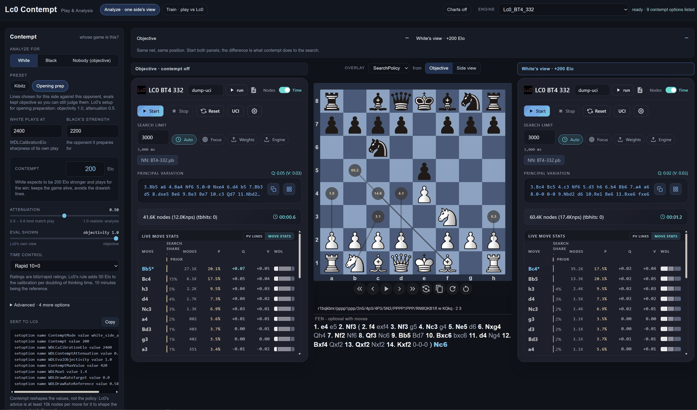

# Lc0 Contempt

`/play/contempt` (Play & Analysis → Lc0 Contempt) puts Lc0's contempt in front of you as settings instead of UCI options: what the engine assumes about the game - how much stronger or weaker than the opponent it takes itself to be, whose side it is looking at, how sharp its own play is calibrated - and shows the exact `setoption` lines that go to the engine.

Contempt changes how Lc0 **plays**, not only what it reports. With contempt on, the net's win/draw/loss estimate is reshaped for an opponent of a given strength: a stronger side steers away from drawish lines and keeps the game alive, a weaker side plays to hold. Nothing else in the engine is touched.

Contempt reshapes the values in the search tree, not the policy. Lc0's own disclaimer: let the search run for at least 10k nodes to get the intended result - with fewer nodes the policy still picks the moves and contempt shows mostly in the eval.

Only Lc0 has these options (v0.31 and later). The page checks the engine's option list when it starts and says so if the engine is not an Lc0, or an Lc0 too old for the WDL options.

*Analyze mode: the same net on the same position, objective on the left and from White's view with +200 Elo contempt on the right.*

## Two modes, one panel

**Train - play vs Lc0.** The Play vs Computer game with the contempt panel beside it. Pick what Lc0 plays at and your own rating; the difference is its contempt. Change a setting during a game and the next engine move uses it.

**Analyze - one side's view.** The page opens here. The same position searched twice on the same net: one panel objective (`ContemptMode disable`), one from the chosen side's point of view. The strip above the board shows both evals; the panels show both lines. Start each panel as in Dual analysis. Two Lc0 processes run, so two copies of the net are on the GPU.

## The panel

| Control | Lc0 option | What it does |
|---|---|---|
| Preset | several | A named starting point; every field can be changed afterwards. |
| Lc0 plays at / White (Black) plays at | `WDLCalibrationElo` | The strength Lc0's own play is calibrated to. 0 keeps the net's raw WDL, no sharpening or softening. |
| Your rating / the other side's strength | - | The opponent Lc0 prepares for. Contempt follows the difference until you type a value of your own. |
| Contempt | `Contempt` | Lc0's assumed Elo advantage: positive plays for the win, negative plays to hold. Values above the cap are capped. |
| Attenuation | `WDLContemptAttenuation` | How strongly the Elo gap is applied. Lc0's own advice: 1.0 for realistic analysis, 0.5-0.6 for the best match results. |
| Eval shown | `WDLEvalObjectivity` | 0.0 reports the WDL Lc0 actually plays by, 1.0 an objective eval. With 1.0 the displayed eval barely moves even though the play does - set it to 0 to see what contempt does. |
| Time control | `WDLCalibrationElo` (adjustment) | The ratings you type are blitz/rapid ratings. Lc0's rule: add 50 Elo to the calibration per doubling of thinking time, 10 minutes being the reference (3+2 sends −90, 15+10 +30, 30+0 +80). Train reads the game's clock; Analyze has a picker. |
| Analyze for | `ContemptMode` | `play` in a game; `white_side_analysis` / `black_side_analysis` in Analyze; `disable` for Objective / Nobody. |
| Advanced: Contempt max | `ContemptMaxValue` | The cap, 420 by default. |
| Advanced: WDL max S | `WDLMaxS` | Limits the sharpness contempt can produce; raise it for DFRC or piece odds. |
| Advanced: Draw-rate target | `WDLDrawRateTarget` | An alternative way to set accuracy; 0 is off and it is ignored while a calibration Elo is set. |
| Advanced: Draw-rate reference | `WDLDrawRateReference` | The draw rate the net predicts at default settings. The page starts at 0.58, Lc0's advice for recent strong nets (its own default is 0.5). |

The four Advanced options are hidden in Lc0's `uci` list (they appear only with `--show-hidden`) but Lc0 accepts them from `setoption` regardless.

**Presets (Train)**

- *Objective* - contempt off.
- *Club sparring* - Lc0 plays like a player of the chosen strength who knows your rating. Attenuation 0.6.
- *Play for the win* - Lc0 keeps its strength and prepares for an opponent a full cap (420) below it, whoever is at the board: the opponent that never takes a draw.
- *Hold vs stronger* - Lc0 is the weaker player and plays solid; practise converting an edge. If Lc0's rating is the higher one the two ratings are swapped.

**Presets (Analyze)** - both from Lc0's own suggested setups:

- *Kibitz* - what this side sees: objectivity 0.0, attenuation 1.0.
- *Opening prep* (the default) - lines chosen for this side, evals kept objective: objectivity 1.0, attenuation 0.5.

A preset never shows a contempt the two ratings do not explain: contempt is always Lc0's strength minus the opponent's, and a preset that wants a particular gap moves a rating instead.

## Sent to Lc0

The box at the bottom of the panel is the complete list of `setoption` lines the page sends, in order, with a Copy button - paste them into any UCI console to get the same engine. They are sent when the engine starts and, after a change, right before the next search or engine move, followed by `ucinewgame`: Lc0 keeps its search tree between moves and for a repeated position, and nodes searched under the old settings would otherwise keep the old contempt. Every batch sent is also echoed to the console (the Log window in the desktop app), line by line, so what Lc0 actually received can be read off the screen.

## Example

Ruy Lopez after 3...a6, BT4-332, 400 nodes, calibration 2800 against a 2500 opponent (contempt 300), eval shown 0.0:

| View | Eval | W / D / L | First choice |
|---|---|---|---|
| Objective | +0.12 | 26 / 53 / 21 | 5. O-O Nxe4, the open variation |
| White's | +1.54 | 65 / 30 / 5 | 5. d3, keeping the tension |
| Black's (Black the stronger side) | -1.23 | 7 / 36 / 57 | |

Same net, same nodes; the difference is what contempt does to the search.

## Tournaments

Tournament play has its own, older contempt path (`ContemptEnabled` and `NegativeContemptAllowed` on an engine def, see EngineDefConfig.md): the rating difference between the two engines is sent as `Contempt` before each game. It does not use this page's settings.
