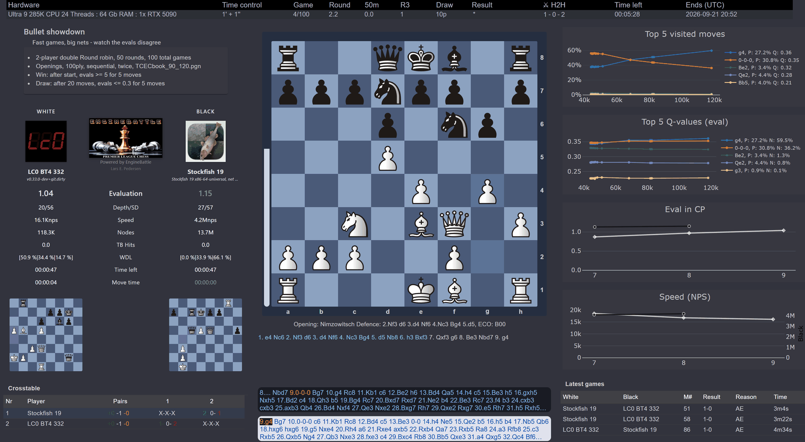
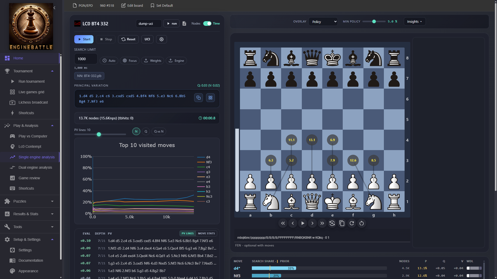
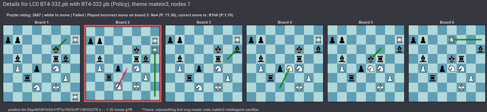

# EngineBattle

[](https://discord.gg/tRMYTbk5TE)

**EngineBattle** is a comprehensive tool for running tournaments, testing, analyzing, and comparing chess engines. It supports engines using the **UCI** and **Winboard/XBoard** protocols. With puzzle-based testing, detailed analysis, tournament management, and interactive visualizations, it is ideal for chess developers, researchers, and streamers.


*Example: Tournament GUI — follow live games, standings, and results with interactive visualizations.*

---

## 🚀 Key Features

### 🧩 Puzzles

- **ERET Puzzles:** Test engine performance using The Eigenmann Rapid Engine Test (ERET) puzzles designed for precise evaluation of chess positions.
- **Lichess Puzzles:** Direct integration with Lichess puzzles, supporting policy head tests, value head tests, and combined evaluations.
- **Visualization of Puzzles:** Automatically visualize puzzles that engines fail, clearly showing correct versus incorrect moves on an chessboard.

### 🎯 Tournament Features

- **Prevent Move Deviation option:** Ensures consistent move ordering across game formats, beneficial in gauntlet and round-robin tournaments, even when transpositions occur.
- **Fischer Random Chess (Chess960):** Supports Chess960, facilitating tests and tournaments with randomized starting positions.
- **Flexible Time Controls:** Fully customizable time or node limits per engine, including asymmetric configurations.
- **Reference PGN Files:** Optionally enforce move consistency with reference PGNs from previous EngineBattle tournaments.
- **Dynamic Engine Addition:** Engines can be added to tournaments after they begin, with new engines seamlessly catching up.
- **Tablebase Adjudication:** Built-in GUI support for adjudicating endgames using chess tablebases.
- **Opening Books:** Create and utilize opening books based on FEN and PGN files.
- **Move Delay Option:** Specify delays between moves, useful for clearly demonstrating forced checkmate sequences.
- **Node-Limited Matches:** Conduct node-limited games (e.g., policy tests with single-node searches).
- **Principal Variation (PV) Boards:** Display real-time PV boards per engine, highlighting evaluation disagreements visually with colored arrows.

### Tournament Modes

EngineBattle supports five tournament formats configured via `TournamentMode` in `tournament.json`:

- **Round Robin (RR):** Every engine plays every other engine once (or twice in double round-robin).
- **Gauntlet:** One or more challengers play against a pool of opponents for fast benchmarking.
- **Cup:** Single-elimination knockout with configurable games per match and optional seeding.
- **Swiss:** Pairings are based on score each round, scaling well for larger fields.
- **Swiss (odd players):** If the player count is odd, one engine receives a bye each round (worth 1 point) and byes are not repeated when possible.
- **Ladder:** Elimination-style climbing tournament where engines challenge upward by rating. The loser is eliminated and the winner keeps climbing until only one engine remains.

See [TournamentConfig.md](TournamentConfig.md) for configuration details, plus [SwissMode.md](SwissMode.md), [CupMode.md](CupMode.md), and [LadderMode.md](LadderMode.md) for mode-specific notes.


### 🔍 Analysis Mode

- **Intuitive Analysis Interface:** User-friendly interface for convenient position analysis, featuring search charts similar to those used in tournament mode. Includes overlay options to display additional information for MCTS engines like Lc0 and Ceres.
- **Dual-Engine Comparison:** Compare two engines simultaneously with side-by-side analysis, move lists, and detailed graphical evaluations.
- **Game Review:** Lichess-style move-by-move accuracy analysis with win probability tracking, move classifications (Brilliant, Great, Best, Inaccuracy, Mistake, Blunder), critical moves panel, and annotated PGN export. Supports single-game and batch review.
- **Focus Mode:** Restrict engine search to specific candidate moves for targeted position exploration.
- **UCI Script Loading:** Load a text file of UCI commands to quickly configure engine parameters during analysis.

### 📚 PGN and EPD Tools

- **Speed Calculation:** Benchmark chess engines by calculating their median and average speeds from a PGN-file, including out of book speed. (first search).
- **Ordo Tables:** Automatically generate Ordo rating tables to rank engine performance based on tournament outcomes.
- **Opening Books from PGN:** Create custom opening books from existing PGN archives (such as TCEC games).
- **Opening Books from EPD:** Generate opening books directly from EPD files.
- **Chess960 Position Generation:** Quickly generate random Chess960 positions (EPD format) for diverse testing scenarios.
- **Remove an engine from a PGN-file:** Remove a specific engine's games from a PGN file to clean up tournament results or resume a tournament without including that engine.
- **Move Deviation Finder:** Easily identify and visualize deviations by chess engines compared to a reference engine in a PGN file, presented clearly with summary tables and visualized with chessboards.
- **Out-of-Book Evaluation:** Evaluate opening positions right after book exits using one or more engines to filter out openings that are too drawish or too one-sided for engine matches.

### 📈 Visualization and Statistics

- **Live MCTS Charts:** Real-time visualization of Monte Carlo Tree Search (MCTS) engine internals, including N-Plot and Q-Plot charts for engines like Lc0 and Ceres.
- **Evaluation Charts:** Visual representation of engine evaluation statistics throughout tournaments.
- **Time Usage Charts:** Detailed graphical display of engine time management.
- **Nodes Per Second (NPS) Charts:** Track and visualize computational speed and efficiency.
- **Nodes Per Move (NPM) Charts:** Clearly depict nodes used per move by each engine in tournaments.
- **Configurable Search Charts:** Customize the number of moves displayed and configure delta Q values to filter inferior moves from visualizations.

### 💻 Console Mode

- **Basic Console Mode:** Minimalist console mode designed for quicker time controls and node-testing, supporting parallel execution of multiple games for quick benchmarking. Console mode requires building from source (see [Build from Source](#-build-from-source) section).
- **Puzzle Testing in Console Mode:** Easily run automated engine tests on chess puzzles directly from the console. Configure puzzle sources, formats, and test parameters using the [PuzzleConfig.md](PuzzleConfig.md) file for flexible and reproducible puzzle-based benchmarking. Results can later be viewed and analyzed in the GUI by loading the generated .epd file for puzzle visualization (accessible via Tools > Test Canvas in the GUI menu).

### ⚙️ Global Settings

- **Persistent Preferences:** A dedicated settings page to configure default paths, search modes, MultiPV, analysis defaults, game review parameters, and more. Settings persist across sessions.

### 🎥 Streaming and Community Features

- **Streamer-Friendly Tournaments:** Optimized tournament mode for engaging chess engine streaming, making it easy to share standings and results in real time.
- **Web Application:** Runs seamlessly in browsers, providing live console logs, pairings, standings, and results, ideal for live updates via Discord and other community platforms.

---

## 📦 Quick Start

Pre-built binaries are available from [GitHub Releases](https://github.com/lepned/EngineBattle/releases).

### 1. Download

Choose a variant:

| Variant | Size | .NET Runtime Required? |
|---------|------|----------------------|
| **Self-contained** | ~58 MB | No — everything is bundled |
| **Framework-dependent** | ~16 MB | Yes — install [.NET 10 Runtime](https://dotnet.microsoft.com/download/dotnet/10.0) first |

Available platforms: **win-x64**, **win-arm64**, **linux-x64**, **osx-x64**, **osx-arm64**

### 2. Run

Extract the zip and run:

- **Windows:** `EngineBattle.exe`
- **Linux / macOS:** `./EngineBattle`

Your browser opens automatically. If not, navigate to the localhost URL shown in the console.

> **Windows note:** Windows may show a SmartScreen warning for unsigned executables. To bypass this, right-click `EngineBattle.exe` → **Properties** → check **Unblock** → **OK**, then run it normally.

### 3. First Run

A blank `tournament.json` is auto-created next to the executable on first startup. See [Configuration](#configuration) below to set up your engines.

---

## 🛠 Build from Source

For developers who want to modify the code, use the CLI console commands, or run the latest unreleased changes.

### Prerequisites

[.NET 10.0 SDK](https://dotnet.microsoft.com/download/dotnet/10.0) or later.

### Clone and Run

```bash
git clone https://github.com/lepned/EngineBattle.git
cd EngineBattle/WebGUI
dotnet run -c release
```

A console application should now run with a link to the localhost URL. Ctrl + click on the link to open the URL in the browser. To keep your local copy updated:

```bash
git pull origin main
```

### Console Commands (source builds only)

The Console project provides CLI commands not included in the release binaries:

```bash
cd Console
dotnet run -c release -- tournamentjson <fullPathToTournament.json>
dotnet run -c release -- puzzlejson <fullPathToPuzzleConfig.json>
dotnet run -c release -- eretjson <fullPathToEretConfig.json>
dotnet run -c release -- analyze <engine> [fen] [options]
dotnet run -c release -- compare <engine1> <engine2> [options]
dotnet run -c release -- tune <fullPathToTunerConfig.json>
```

---

## Configuration

Before you can do much with the GUI, you need to configure all the engines you want to use. Follow these steps to configure `EngineSetup`:

1. Edit the `tournament.json` file - [Tournament Configuration Reference](TournamentConfig.md).
    - **Release binaries:** `tournament.json` is auto-created next to the executable on first startup.
    - **Source builds:** `tournament.json` is located in the `WebGUI/wwwroot` folder and is auto-created on first startup if it doesn't exist.
2. Create and define the folder where all `engineDefs` are located. Set the path to this folder under the key: `EngineDefFolder`.
3. Every engine needs an `EngineDef.json` file - [Engine Configuration Reference](EngineDefConfig.md) / [LC0 Configuration Reference](LC0Config.md). Make a copy, configure each engine as you wish, and save it with a proper name like `SFDef.json` for Stockfish.
4. Add all your `EngineDef.json` files that will be part of the tournament under the key: `EngineDefList`. See below for an example of how to do this.
    ```
      "EngineSetup": {
        "EngineDefFolder": "C:/Dev/Chess/Engines/EngineDefs",
         "EngineDefList": [
            "SFDef.json",
            "Lc0Def.json",
            "DragonDef.json"  ]}
    ```
### Folder Structure Example

```
#folder structure example

Engines/
├── EngineDefs/
│   ├── SFDef.json
│   ├── Lc0Def.json
│   └── DragonDef.json
├── LC0/
│   └── Lc0.exe
├── SF/
│   └── SF.exe
└── Dragon/
    └── Dragon.exe
```

3. Set the `OpeningsPath` and the `PgnOutPath` and time settings. Time controls, `MoveOverhead`, and `DelayBetweenGames` (or any other time settings) are specified in `HH:MM:SS:MMM` (MMM = milliseconds).
4. The `UseTBAdjudication` can be turned on and off.

After you have created and configured a `tournament.json` file on your computer, it is highly advisable to make a backup copy. This ensures you can quickly restore your settings if you need to reinstall the application or encounter any configuration issues.

### Images

The `wwwroot` folder includes a selection of images used by the program, located in the Img subfolder. To add new images for engines you include in tournaments, simply place them in the `Img` folder as .png or .jpg files if the image does not already exist there. This allows you to customize the visual representation of each engine in your tournaments.

### Logs

Log files are written to a `logs/` folder in the current working directory. Logs use daily rolling files with a 10 MB size limit per file.

## Running a Tournament

Use your browser's built-in zoom function to adjust the GUI size to your preference. For streaming, it's recommended to set the zoom level to 80% or 90%, depending on your screen resolution and size.
Press F11 to enter full-screen mode — this is also recommended for the best streaming experience.

To operate a tournament, you only need two keys:

- To start a tournament run, press: `ctrl + r`
- To cancel a tournament run, press: `ctrl + c`

Other useful keys are:

- Validate your tournament.json which includes basic validation for all engine.json files, press: `ctrl + v`
- Update and refresh tournament GUI, press: `ctrl + u`

It is strongly recommended to run validation before starting a tournament to ensure that all engine definitions are correct and that the tournament settings are valid.

When the tournament is running, you can use the GUI to follow the games, check the standings, and view the results. The GUI is designed to be user-friendly and intuitive, providing real-time updates and visualizations to enhance the tournament experience.
The console window will display additional tournament progress, including pairings, game results, standings, and other relevant information that can be useful for monitoring the tournament.

### Time Controls
Time controls settings are specified in `HH:MM:SS:MMM` format, where `HH` is hours, `MM` is minutes, `SS` is seconds, and `MMM` is milliseconds. For example, a fixed time control of `00:01:00:000` with an Increment of `00:00:01:000` represents a time control of 1 minute and 1 second increment.
Each time control listed in the `tournament.json` file needs to have an Id and each engine.json file needs to have a corresponding time control Id that references on of the time controls in the `tournament.json` file.
You can use node limits instead of time limits by setting the `NodesLimit` value to true, and the number of `nodes` you want to use in your test, in the `tournament.json` file.
Example of a time control that can be used to run policy tests:

```
{
  "Id": 1,
  "Fixed": "00:01:00.000",
  "Increment": "00:00:01.000",
  "NodeLimit": true,
  "Nodes": 1
}
```

It is recommended to run policy tests in Console Mode for optimal performance by running games in parallel, see below how to set that up. However, you can also run these tests using the GUI by setting a delay per move. To do this, configure the `MinMoveTime` parameter to i.e. 2000 milliseconds in the GUI settings. This allows you to watch every move play out during policy tests and can even be streamed.

### Tournament Console Mode

The console mode is designed for quick and efficient testing, allowing users to run multiple games in parallel for benchmarking purposes. This mode is ideal for policy matches and very quick time controls, such as 20 + 0.3 seconds or less.
In order to use the console mode you need to start the application from the Console folder and run the following command:

` dotnet run -c release tournamentjson <fullPathToYourTournament.json> `

There is a setting in the `tournament.json` file that allows you to set the number of games that can be run in parallel in the console mode. This setting is called `NumberOfGamesInParallelConsoleOnly` and can be set to any number you like. The default value is 2 but values up-to 4 games can be recommended for a strong GPU. If you run games in parallel 'PreventMoveDeviation' feature will be disabled, see below.

### PreventMoveDeviation Feature

The **"PreventMoveDeviation"** feature is designed to enhance engine testing by enforcing a consistent move order across different game formats. Stockfish, for example, typically deviates from earlier games played in the same position—about twice per game—which can introduce inconsistencies in testing.

**Important**: This feature requires **single-threaded tournament execution** because the deviation prevention logic must sequentially compare each engine's move choice against its previous play history in the same position. Running games in parallel would prevent this cross-reference mechanism from working correctly.

By strictly adhering to a reference-based move order and tracking position hashes, this feature ensures that recurring board states are consistently recognized, even when transpositions occur. This controlled approach is beneficial in both gauntlet tournaments—where one or more engines play against every other participant—and in normal round-robin tournaments, where engines are prevented from deviating from moves they have previously played in the same position. As a result, testers can evaluate and compare engine performance with greater precision under these uniform conditions.

### Live Plot Charts for MCTS Engines
The live plot charts (N-Plot and Q-Plot) are particularly useful for visualizing the internal thinking or search process of Monte Carlo Tree Search (MCTS) engines like Lc0 and Ceres. These charts provide insights into how these engines evaluate positions and make decisions during the game.

- **N-Plot Chart**: Displays the top N moves by nodes visited (%) during the search window, along with Q (evaluation) and policy (P %) values. If the top policy move is not part of the top N moves, it will also show this move in red with Q and P values. This chart helps in understanding how the search is biased during gameplay and how strongly the policy prefers one move over another.
- **Q-Plot Chart**: Shows the top N moves by Q-value (evaluation) during the search window, along with nodes visited (N %) and policy (P %) values. If the top policy move is not part of the top N Q-moves, it will show this move in red with N and P values. This chart provides a detailed view of the engine's evaluation process and the influence of the policy network.

### Evaluation Chart
- **Eval Chart**: Displays evaluation statistics for the tournament. It is referenced by `evalChart`.

### Time Usage Chart
- **Time Usage Chart**: Shows the time usage statistics for the tournament. It is referenced by `timeUsageChart`.

### Nodes Per Second (NPS) Chart
- **NPS Chart**: Displays the nodes per second statistics. It is referenced by `npsChart`.

### Nodes Per Move (NPM) Chart
- **NPM Chart**: Shows the nodes per move statistics for the tournament. It is referenced by `nodesChart`.

These charts are conditionally rendered based on the tournament's layout options and settings, providing a comprehensive view of the tournament's progress and performance metrics.


### End of game result

The `ResultReason` type defines various reasons for the outcome of a chess game. Each reason is represented by a specific code and an explanation. Below is a summary of the type:

- **Checkmate (CM)**: The game ended in checkmate.
- **Stalemate (SM)**: The game ended in a stalemate.
- **AdjudicateTB (TB)**: The game was adjudicated based on tablebase knowledge.
- **AdjudicateMaterial (AM)**: The game was adjudicated due to insufficient material.
- **ExcessiveMoves (50m)**: The game ended due to excessive moves (50-move rule).
- **Repetition (R3)**: The game ended in a draw by repetition.
- **AdjudicatedEvaluation (AE)**: The game was adjudicated based on evaluation agreement.
- **ForfeitLimits (FL)**: The game was forfeited due to time or node limits.
- **Disconnected (DC)**: The game ended due to a disconnect.
- **AdjudicatedByUser (AU)**: The game was adjudicated by a user.
- **Cancel (XX)**: The game was canceled.
- **Illegal (IM)**: The game ended due to an illegal move.
- **NotStarted (NS)**: The game has not started.

Each `ResultReason` has a corresponding explanation that provides more details about the reason for the game's outcome.


## Analysis Mode

The analysis mode provides a user-friendly interface for analyzing chess positions and optionally comparing engine evaluations side by side.

Analysis mode uses a `AnalyzeConfig.json` file - [Link to AnalyzeConfig.json](AnalyzeConfig.md) - to pick engines in order from top to bottom, so the first engine in the list will be picked for single analysis and the first two engines will be picked for dual analysis.

The dual analysis mode is designed to compare two engines at a time, displaying their evaluations, moves, and search statistics in a clear and concise manner.


*Example: Dual analysis mode — compare two engines side by side with synchronized move lists and evaluations.*


## Puzzle Testing Mode

### Lichess Puzzle Testing Mode
The puzzle testing mode allows users to evaluate chess engines using a variety of Lichess puzzles, providing insights into their performance on specific positions. This mode uses the `PuzzleConfig.json` file - [Link to PuzzleConfig.json](PuzzleConfig.md) - to configure the engines, puzzle sources, and test parameters.

The `PuzzleConfig.json` file defines the engines to be used, the puzzle file path, and the testing parameters. In this mode, engines are tested on puzzles sampled from the specified file, with options to filter puzzles by type, rating, or specific characteristics. The configuration also supports running tests with node limits or concurrent engine instances for efficient benchmarking.
This mode is ideal for developers and researchers who want to test engine capabilities on specific puzzle types, such as mate-in-N problems, endgame studies, or tactical motifs. The results can be visualized to identify areas where engines excel or struggle, providing valuable feedback for engine improvement.
For more information about how to run Lichess puzzles, see [LichessPuzzle.md](LichessPuzzle.md).


*Example: Visualization of a failed puzzle — the engine's move (red) vs. the correct move (green).*

### ERET Testing Mode

The ERET (Eigenmann Rapid Engine Test) testing mode is designed to evaluate chess engines using a set of carefully curated puzzles for rapid and precise performance assessment. This mode uses the `EretConfig.json` file - [Link to EretConfig.json](EretConfig.md) - to configure the engines, puzzle sources, and test parameters.

The `EretConfig.json` file specifies the engines to be tested, the puzzle file path, and the testing parameters such as time or node limits. It supports both time-based and node-limited testing, allowing users to choose the evaluation method that best suits their needs. The configuration also enables concurrent engine testing for efficient benchmarking.

This mode is ideal for developers and researchers who want to quickly assess engine performance on a diverse set of positions, providing valuable insights into engine strengths, weaknesses, and overall capabilities.
For more information about how to run ERET puzzles, see [EretPuzzles.md](EretPuzzles.md).


## Licensing

EngineBattle License Summary

This application is licensed under the GNU General Public License (GPL) version 3. For more details, see the [License.txt](./License.txt) file.

For the full license text, please visit the official GNU website:
[GNU General Public License, version 3](https://www.gnu.org/licenses/gpl-3.0.html)

### Additional Licensing Information

This application uses the following libraries, which are licensed under their respective licenses:

- **.NET** - [MIT License](https://github.com/dotnet/runtime/blob/main/LICENSE.TXT)
- **Blazor** - [MIT License](https://github.com/dotnet/aspnetcore/blob/main/LICENSE.txt)
- **MudBlazor** - [MIT License](https://github.com/MudBlazor/MudBlazor/blob/dev/LICENSE)
- **Serilog** - [Apache License 2.0](https://github.com/serilog/serilog/blob/dev/LICENSE)
- **CommandLineParser** - [MIT License](https://github.com/commandlineparser/commandline/blob/master/License.md)
- **Fathom** - [MIT License](https://github.com/basil00/Fathom/blob/master/LICENSE)
- **Toolbelt.Blazor.HotKeys2** - [Mozilla Public License 2.0](https://github.com/jsakamoto/Toolbelt.Blazor.HotKeys/blob/master/LICENSE)
- **CliWrap** - [MIT License](https://github.com/Tyrrrz/CliWrap/blob/master/License.txt)
- **chessboardjs** - [MIT License](https://github.com/oakmac/chessboardjs/blob/master/LICENSE.md)
- **plotly.js** - [MIT License](https://github.com/plotly/plotly.js/blob/master/LICENSE)
